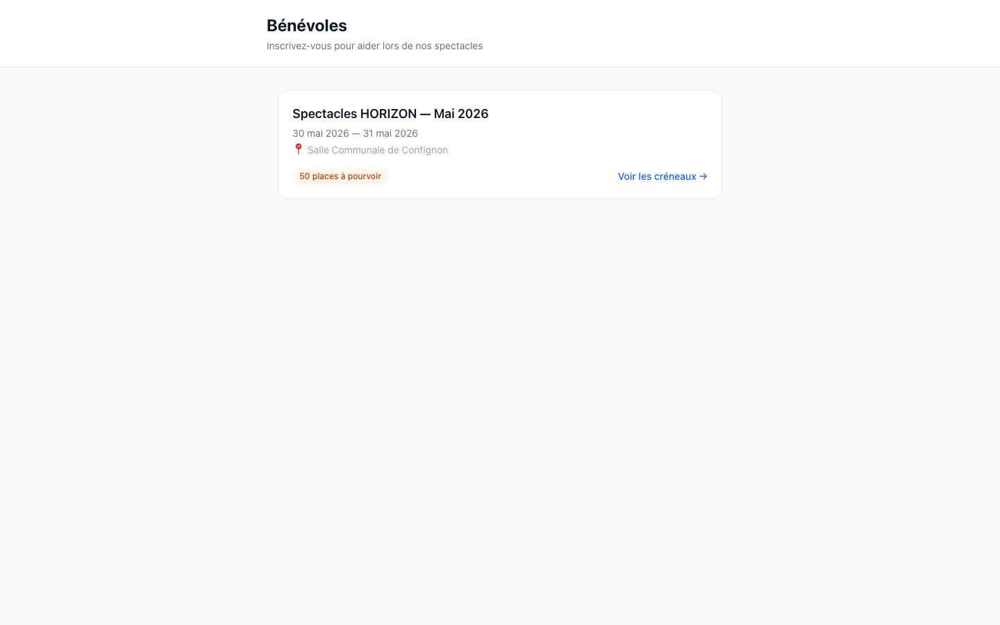
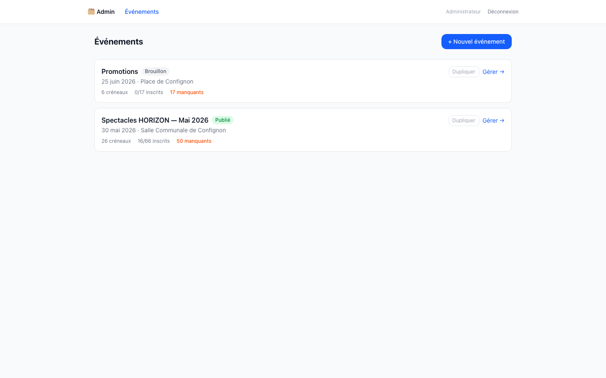
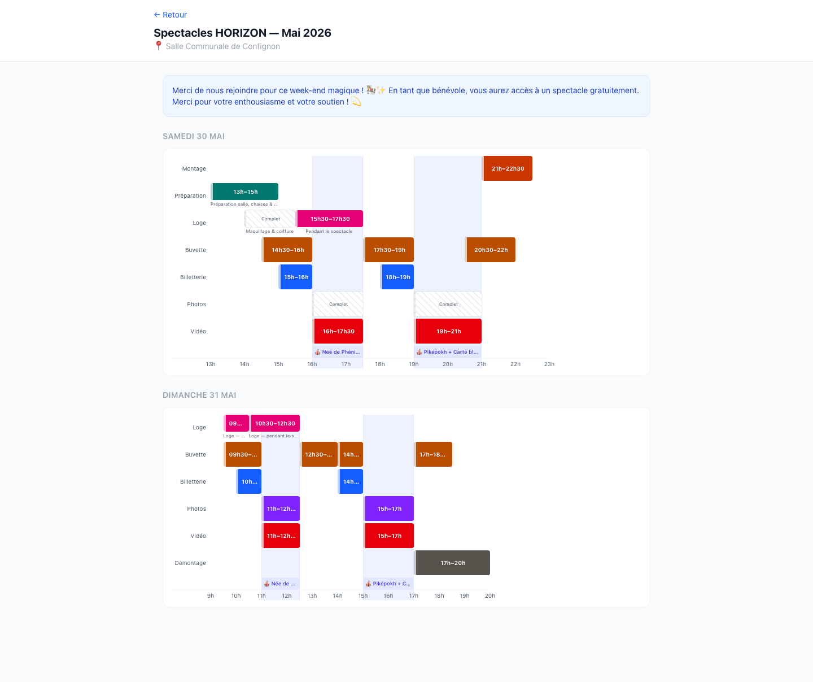
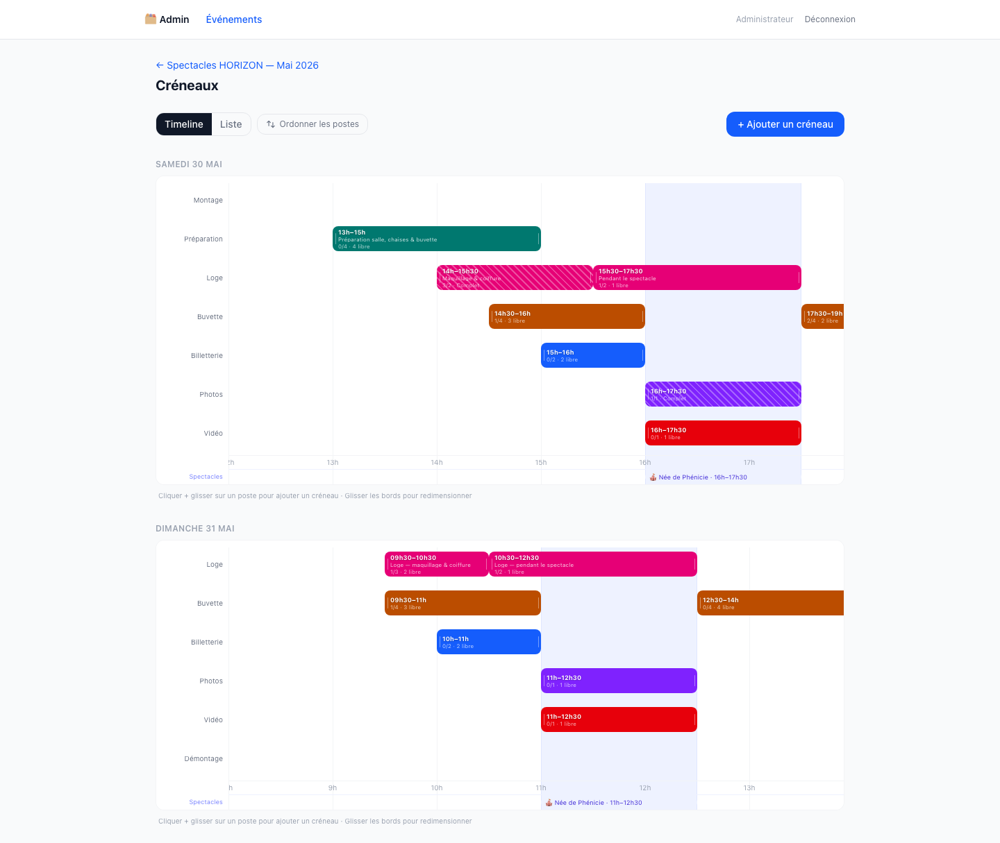
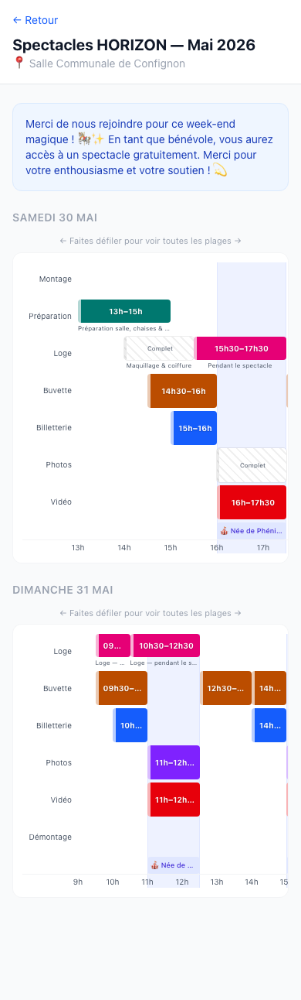
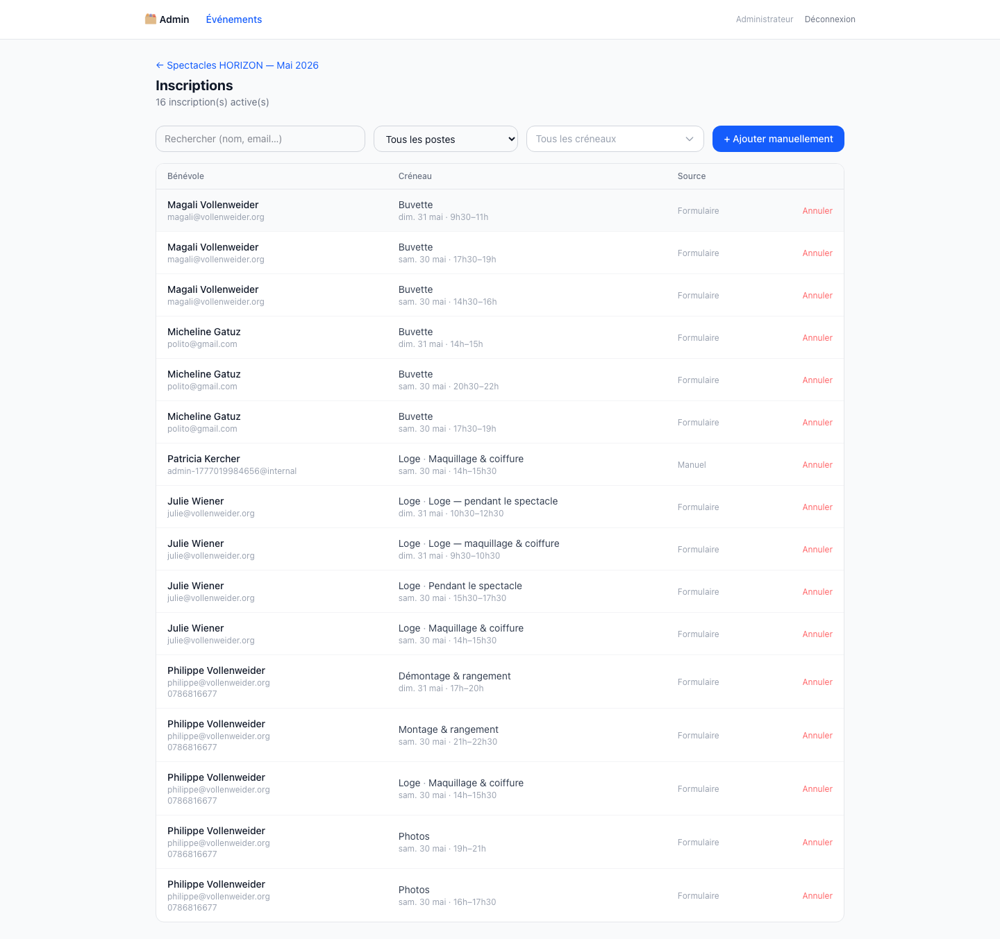
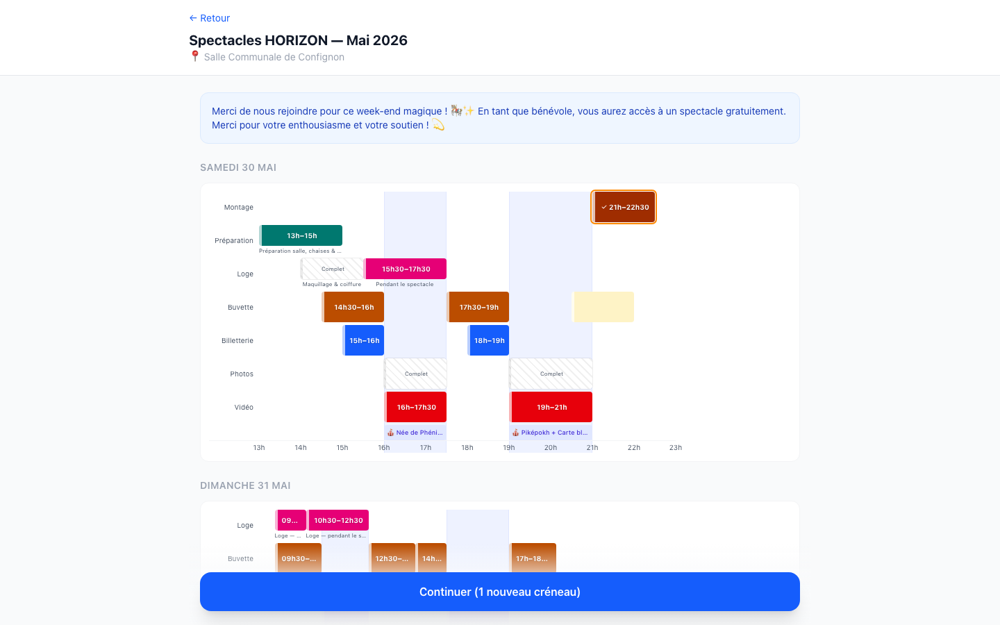
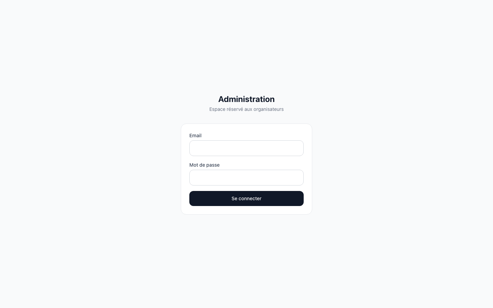
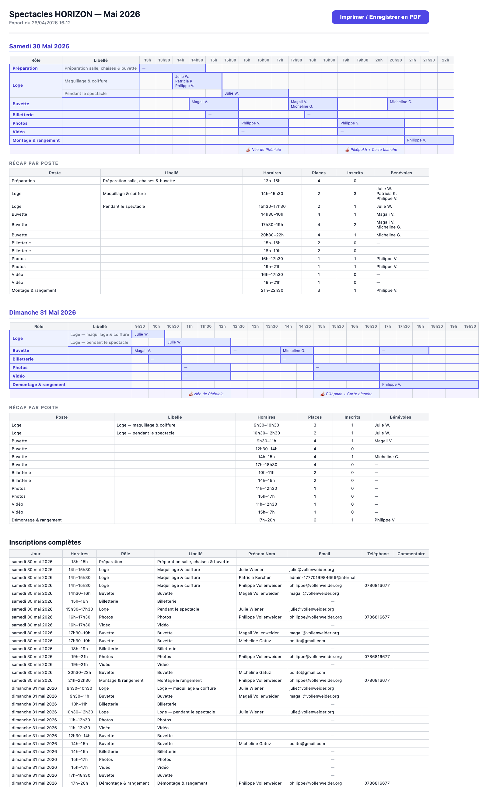

# Fonctionnalités

Liste exhaustive des fonctionnalités de l'application.

---

## Aperçu

| Vue publique | Interface admin |
|:---:|:---:|
|  |  |
|  |  |
|  |  |
|  |  |

---

## Côté public (bénévoles)

### Page d'accueil

- Liste des événements publiés avec titre, dates et lieu
- Accès direct à la page d'inscription de chaque événement

### Page d'inscription (`/events/[slug]`)

#### Timeline Gantt

> Vue mobile avec scroll horizontal

- Planning visuel par jour sous forme de **timeline Gantt scrollable**
  - Échelle horizontale calculée dynamiquement à partir du créneau le plus large (scroll tactile fonctionnel sur mobile)
  - Une ligne par rôle ; libellé spécifique affiché sous la barre quand il diffère du rôle
  - Bandes colorées en fond représentant le programme des spectacles
- **Sélection multi-créneaux** par clic sur les barres
- **Détection de conflits en temps réel** : les créneaux qui se chevauchent avec une sélection ou une inscription existante sont grisés automatiquement
- Affichage du statut de chaque créneau : ouvert, complet, fermé
- Récapitulatif des créneaux sélectionnés sous le planning
- Bouton d'action fixe en bas d'écran

#### Session persistante
- Reconnexion automatique via `localStorage` si le bénévole revient dans le même navigateur
  - Nom affiché en haut de page, bouton « Quitter la session »
  - Créneaux existants chargés en vert, conflits mis en évidence automatiquement

### Formulaire d'inscription

- Champs : prénom, nom, email, téléphone (optionnel), commentaire (optionnel)
- Pré-remplissage automatique si une session est reconnue
- Case de consentement obligatoire
- Validation côté client et côté serveur (Zod)

### Confirmation et gestion (`/my/[token]`)
- Page de succès avec lien personnel de gestion
- Envoi automatique d'un email de confirmation avec récapitulatif des créneaux inscrits
- Page de gestion : liste de toutes les inscriptions actives du bénévole pour l'événement
- Annulation individuelle d'un créneau depuis la page de gestion

---

## Côté administrateur (`/admin`)

### Authentification

- Connexion par email + mot de passe (hashé bcrypt, NextAuth v5)
- Déconnexion

### Gestion des événements

- Création, édition et suppression d'événements
- Champs : titre, slug, dates, lieu, description, instructions publiques, message de confirmation
- **Publication / dépublication** en un clic (`draft` → `published`)
- Vue de synthèse : créneaux, places totales, inscrits, places restantes
- Lien direct vers la vue publique

### Programme des spectacles
- Ajout, édition et suppression de plages de spectacles par jour
- Sauvegarde automatique avec délai (debounce)
- Affichage en fond coloré sur la timeline publique et dans les exports

### Gestion des créneaux (`/admin/events/[id]/shifts`)

- Ajout de créneaux : rôle, libellé, date, horaires, capacité, statut, ordre d'affichage
  - Saisie des horaires tolérante : `9` → `09:00`, `14:3` → `14:30`
  - Fin automatiquement fixée à start + 1 h si non renseignée
- Icônes colorées par rôle (palette prédéfinie avec correspondance automatique)
- Autocomplétion des rôles existants
- Modification, suppression et changement de statut : ouvert → fermé → complet → annulé
- **Réordonnancement des postes** : panneau glisser-déposer pour changer l'ordre des lignes dans toutes les timelines (admin et public), persisté via `displayOrder`
- **Vue timeline** (par jour) et **vue liste** (tableau plat) commutables
  - Vue timeline : glisser pour créer un créneau, redimensionner les bords
  - Vue liste : affichage places occupées/total + places libres restantes en couleur
- Popover au clic sur un créneau : éditer libellé, capacité, statut — bouton direct vers les inscriptions filtrées sur ce créneau

### Suivi des inscriptions (`/admin/events/[id]/registrations`)

- Vue tabulaire : bénévole, créneau, horaires, commentaire, source, date
- Annulation d'une inscription individuelle
- **Filtres cumulables** : recherche texte, filtre par poste, filtre par créneau (dropdown avec date/horaire/statut coloré)
- Accès direct depuis un créneau (timeline admin) : pré-filtrage automatique sur le créneau et le poste
- **Ajout manuel** avec détection de conflits :
  - Liste déroulante stylisée : date, horaires, poste, statut (vert/rouge/vide)
  - Dès qu'un email est saisi, les créneaux déjà pris par ce bénévole sont marqués « Déjà inscrit » (orange) et les créneaux en conflit horaire sont marqués « ⚠ conflit » (amber)
  - Message contextuel si le créneau sélectionné est en conflit avec une inscription existante

### Exports

#### Excel (`.xlsx`)
- Un onglet par jour avec Gantt : rôles × tranches de 30 minutes, noms des bénévoles dans les cellules
- Créneaux de même `(rôle, libellé)` fusionnés sur une seule ligne Gantt
- Plages des spectacles en fond coloré (ligne dédiée)
- Tableau récapitulatif : rôle, libellé, horaires, capacité, inscrits, liste des bénévoles
- Onglet « Inscriptions » avec toutes les données détaillées
- Bénévoles triés alphabétiquement par prénom

#### PDF (impression navigateur)

- Même structure Gantt + récapitulatif, optimisée A4 paysage
- Tableau complet des inscriptions en fin de document
- Bouton « Imprimer / Enregistrer en PDF »

---

## Notifications email

- **Confirmation bénévole** : récapitulatif des créneaux + lien de gestion personnelle
- **Notification admin** (optionnelle) : alerte à chaque nouvelle inscription
- Transport SMTP configurable (tout fournisseur compatible : Gmail, Mailgun, Brevo…)
- Fallback console si SMTP non configuré (développement)

---

## Infrastructure

- Next.js 16 App Router (rendu hybride SSR + client), Turbopack par défaut
- API REST séparée public / admin (routes Next.js)
- PostgreSQL 16 + Prisma 7 ORM (driver natif pg, migrations versionnées)
- Déploiement Docker (Compose ou image standalone)
- Déploiement Kubernetes avec init container pour migrations automatiques
- CI/CD GitHub Actions : build, push image GHCR, déploiement automatique sur push `main`
